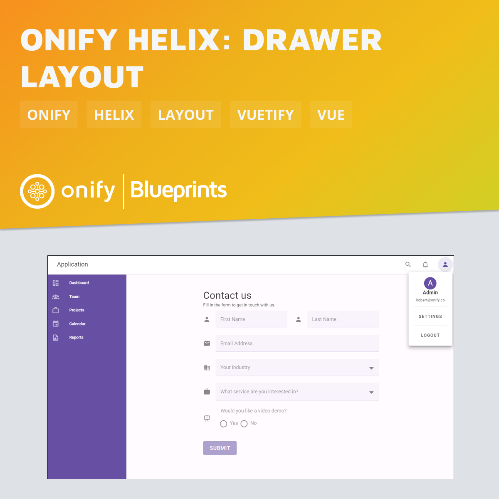

[](https://www.repostatus.org/#wip)

# Onify Blueprint: Helix - Drawer layout

This Vue file defines a custom layout for use in Onify Helix. It includes a user settings dialog, an app bar with navigation and user settings menu, a navigation drawer with menu items, and a main content area. The component uses Onify Helix dependencies like `@onify/helix-pages` for page management and `@onify/helix-core` for configuration. It also handles user settings visibility and logout functionality. The layout is structured using Onify Helix and Vuetify components. This file is intended to be seen as a starting boilerplate to build your own layout.

> This layout is based on [Drawer Layout 08](https://snips.vuetifyjs.com/application-ui/core-layouts/drawer-layouts#snips-drawer-layout-08) from [Vuetify Snips](https://snips.vuetifyjs.com). Please contact us if you want more information how to use these "snips" in Onify Helix.

> Also have a look at [Onify Blueprint: Helix - Contact us form](https://github.com/onify/blueprint-helix-contact-us-form) that is used in this example.



## Requirements

* Onify Helix (v0.30.0 or higher)
  
## Setup

1. Copy `drawer-layout.vue` to `/src/custom/layouts` in your Onify Helix app.
2. Add layout in `/config/pages.yml` (see example below)

**/config/pages.yml**

```yml
- name: contact-us
  path: /contact-us
  import: ../src/custom/pages/contact-us.vue
  layout:
    import: ../src/custom/layouts/drawer-layout.vue # Here you can set the custom layout
```

## Support

* Community/forum: https://support.onify.co/discuss
* Documentation: https://support.onify.co/docs
* Support and SLA: https://support.onify.co/docs/get-support

## License

This project is licensed under the MIT License - see the [LICENSE](LICENSE) file for details.